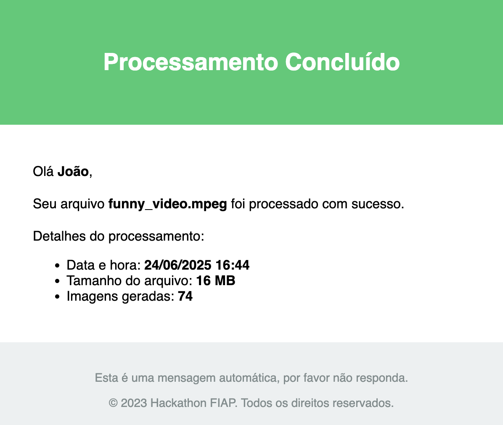

# hackathon-iac

Este repositório contém a infraestrutura como código (IaC) para o projeto Hackathon SOAT. Utiliza Terraform para provisionamento de recursos em nuvem, incluindo API Gateway, Cognito, S3, SQS e outros serviços necessários para o ambiente de homologação.

## Estrutura do Projeto

- `infra/v1/`: Contém os módulos Terraform para os principais recursos de infraestrutura.
- `env/homolog/`: Define o ambiente de homologação, referenciando os módulos e variáveis necessários.
- `lambdas/python/`: Código fonte das funções Lambda utilizadas no projeto.

## Como usar

1. Instale o Terraform.
2. Configure suas credenciais de provedor de nuvem.
3. Acesse o diretório do ambiente desejado (ex: `env/homolog/`).
4. Execute os comandos Terraform padrão:
   - `terraform init`
   - `terraform plan`
   - `terraform apply`

Consulte os arquivos individuais para detalhes de configuração de cada recurso.

## Execução do Terraform com Variáveis

### Variáveis Necessárias

O projeto requer as seguintes variáveis:

- `verified_email`: Um endereço de e-mail verificado no Amazon SES para envio de notificações.

### Métodos para Fornecimento de Variáveis

Existem várias formas de fornecer as variáveis necessárias ao executar o Terraform:

1. **Arquivo de variáveis (.tfvars)**: Crie um arquivo `terraform.tfvars` ou `<ambiente>.auto.tfvars` no diretório do ambiente:

```
# terraform.tfvars
verified_email = "seu-email@exemplo.com"
```

2. **Linha de comando**: Forneça as variáveis diretamente nos comandos:

```bash
terraform plan -var="verified_email=seu-email@exemplo.com"
terraform apply -var="verified_email=seu-email@exemplo.com"
```

3. **Variáveis de ambiente**: Configure variáveis de ambiente com o prefixo `TF_VAR_`:

```bash
export TF_VAR_verified_email=seu-email@exemplo.com
terraform plan
terraform apply
```

4. **Edição direta do arquivo Main.tf**: Como alternativa, você pode editar diretamente o arquivo `Main.tf` no diretório do ambiente desejado para definir os valores das variáveis.

### Exemplo de Execução Completa

Para executar o Terraform com todas as variáveis necessárias:

```bash
cd env/homolog/
export TF_VAR_verified_email=seu-email@exemplo.com
terraform init
terraform plan
terraform apply
```

### Outputs Importantes

Após a aplicação bem-sucedida do Terraform, diversos outputs estarão disponíveis:

- `api_gateway_url`: URL do API Gateway
- `s3_input_bucket_name`: Nome do bucket S3 para upload de arquivos
- `sqs_queue_url`: URL da fila SQS
- `cognito_client_id`: ID do cliente Cognito para autentica��ão

## Lambda de Envio de Emails

A função lambda para envio de emails utiliza o Amazon SES (Simple Email Service) para enviar emails a partir de templates pré-configurados. Para utilizar esta lambda:

### Pré-requisitos

1. Ter um domínio verificado no Amazon SES
2. Ter templates de email cadastrados no SES
3. Permissões adequadas configuradas para a lambda acessar o serviço SES

### Formato de Chamada

A função espera receber um evento com a seguinte estrutura:

```json
{
  "receiver_email": "destinatario@exemplo.com",
  "sender_email": "remetente@seudominio.com",
  "template_name": "SUCCESS_EMAIL_TEMPLATE",
  "placeholders": {
    "FIRST_NAME": "valor1",
    "FILE_NAME": "valor2",
    ...
  }
}
```

Onde:
- `receiver_email`: Email do destinatário
- `sender_email`: Email do remetente (deve ser verificado no SES)
- `template_name`: Nome do template cadastrado no SES
- `placeholders`: Dicionário com os valores que substituirão as variáveis do template

### Templates Disponíveis

- `success_email_template`: Template para notificação de processamento concluído com sucesso


- `placeholders`: 
  - `FIRST_NAME`, entre outros definidos no template
  - `FILE_NAME`: Nome do arquivo processado
  - `PROCESS_DATE`: Data e hora do processamento
  - `FILE_SIZE`: Tamanho do arquivo
  - `RECORDS_COUNT` Número de imagens geradas processados

### Exemplos de Uso

Chamada via AWS CLI:
```bash
aws lambda invoke --function-name email-notification-lambda \
--payload '{"receiver_email":"usuario@exemplo.com","sender_email":"notificacao@seudominio.com","template_name":"SUCCESS_EMAIL_TEMPLATE","placeholders":{"FIRST_NAME":"Jonathan","FILE_NAME":"video.mpeg","PROCESS_DATE":"20/06/2023 14:30","FILE_SIZE":"17MB","RECORDS_COUNT":"512"}}' \
response.json
```

### Tratamento de Erros

A função retorna objetos com o formato:

- Sucesso: `{"statusCode": 200, "body": "{"message": "Email sent successfully!"}"}`
- Erro: `{"statusCode": 400, "body": "{"error_message": "[DESCRIÇÃO DO ERRO]"}"}`

### Exemplo de e-mail de Sucesso


## Licença

Consulte o arquivo LICENSE para informações de licenciamento.